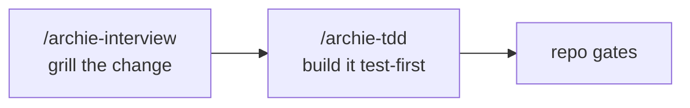
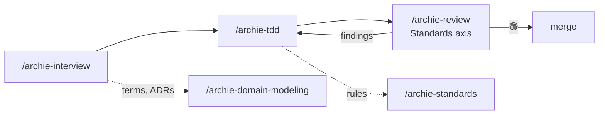
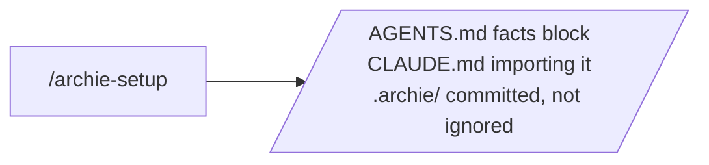
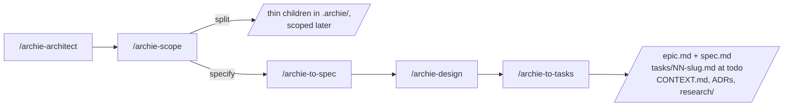
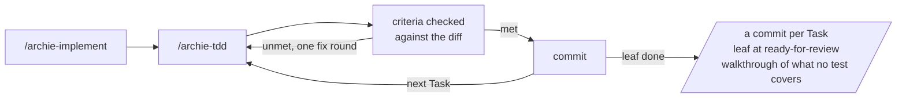
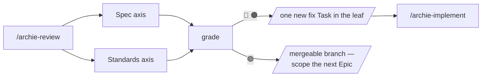

<p align="center">
  
</p>

# Archie

A four-phase way of working with AI agents: **Setup**, **Planning** (HITL), **Implementing** (AFK) and **Reviewing**. Implementing and Reviewing loop until the branch grades mergeable, and Planning restarts the cycle on the next Epic. This repo is Archie's engineering skill bundle — fifteen skills, installable whole or by phase. It replaces mattpocock/skills.

Planning is a conversation rather than a document. It runs in four steps, each ending on a sign-off so each is its own session, with `/archie-architect` as the router that reads which step an Epic is at off its own files. Implementing builds one Task inline or a whole leaf Epic through engineer sub-agents, and Reviewing grades the branch and turns accepted findings into the next fix Task.

## Flows

Archie runs at three depths, and the same install runs any of them. Pick one per piece of work: a one-off chore in lite, the same week's feature in full.

| | **lite** | **medium** | **full** |
| --- | --- | --- | --- |
| Plan | `/archie-interview` | + `/archie-domain-modeling` | `/archie-architect` over its four steps |
| Build | `/archie-tdd` | `/archie-tdd` | `/archie-implement` → `/archie-tdd` |
| Review | — | `/archie-review`, Standards axis | `/archie-review`, both axes |
| Records | `/archie-standards` | + `/archie-setup` | everything |

### lite — one session, nothing on disk but the code



Use it for a chore, a bug fix, or anything you could hold in your head while building it. `/archie-tdd` takes the change itself — a prompt, or the shared understanding the interview closed on — restates the outcome and its acceptance criteria for a sign-off, and runs the repo's gates. Nothing reaches disk but the code and whatever `/archie-standards` was told to remember.

### medium — the same session, with a memory and a reviewer



Use it when the change is small but the reasoning behind it is worth keeping, or when the diff is big enough that you want it read before it merges. `/archie-domain-modeling` writes terms and ADRs as they resolve; `/archie-review` grades the diff. With no Epic to supply the contracts the Spec axis is skipped, and the Standards axis is unchanged.

### full — the four phases

Use it for a feature big enough that you cannot see the whole of it yet. Each phase is its own set of sessions and ends on artefacts the next phase reads, so the handoff is a file rather than a conversation you have to still be in.

**Setup** — once per repo.



**Planning** — HITL, one Epic at a time, one step per session. `/archie-architect` is the door: it resolves a reference like `3.2`, reads which step that Epic is at off its own files, announces it, and runs that one.



**Implementing** — AFK. One Task inline, or the whole leaf as an autonomous loop over its Tasks.



**Reviewing** — grades the branch, and its output is the next phase's input.



Nothing on disk records which flow a repo is using, and no rule keeps them apart. A lite chore committed onto an in-flight Epic branch turns up in that Epic's Spec axis as behaviour nobody asked for — cheap, and you know what you did. See [ADR 0018](docs/adr/0018-archie-runs-at-three-flows.md).

## Install

```bash
npx skills@latest add OvidiuGuta/archie-skills --skill '*'
```

Installs all fifteen skills into whichever agents the installer detects. Upgrade with `npx skills@latest update`.

Archie also ships in **phases you can install separately**. Drop `--skill '*'` and the installer shows them as groups you can tick whole:

| Phase | Skills | Requires |
| --- | --- | --- |
| **Archie Planning** | `archie-setup`, `archie-architect`, `archie-scope`, `archie-interview`, `archie-domain-modeling`, `archie-standards`, `archie-research`, `archie-to-spec`, `archie-design`, `archie-prototype`, `archie-to-tasks` | nothing |
| **Archie Implementing** | `archie-implement`, `archie-assist`, `archie-tdd` | nothing for `archie-tdd` alone; Planning for the other two, which consume the Epic tree |
| **Archie Reviewing** | `archie-review` | Implementing, for `/archie-tdd` fix rounds and the Tasks it writes |

The flows are not install groups, because no flow is a phase: lite reaches for `archie-interview` from Planning and `archie-tdd` from Implementing. Install everything and type the flow you want; the phase groups are for a partial install.

Planning alone is a coherent install: scope, spec, design and slice into Tasks, then hand them wherever you like. Implementing alone gives you `archie-tdd` as a standalone test-first build door, while `/archie-implement` and `/archie-assist` have no tree to read and say which skill is missing rather than improvising. Whole-framework is the recommended install.

Archie **replaces mattpocock/skills** rather than complementing it. Both installed is supported — every skill name is prefixed `archie-`, and the Epic tree lives in `.archie/` rather than `.scratch/` — but running both methods on one repo means two ways of working in one head.

## The skills

One page each, written by the ticket that built the skill.

**Setup and records**

- [`/archie-setup`](manual/skills/archie-setup.md) — records this repo's facts in `AGENTS.md`
- [`/archie-domain-modeling`](manual/skills/archie-domain-modeling.md) — terms into `CONTEXT.md`, decisions into `docs/adr/`
- [`/archie-standards`](manual/skills/archie-standards.md) — coding standards into `STANDARDS.md`

**Planning**

- [`/archie-architect`](manual/skills/archie-architect.md) — the router over the four planning steps
- [`/archie-scope`](manual/skills/archie-scope.md) — the what-step: settle what one Epic covers, split or specify
- [`/archie-to-spec`](manual/skills/archie-to-spec.md) — synthesise the scoping session into `spec.md`
- [`/archie-design`](manual/skills/archie-design.md) — the how-step: data, contract, structure, dependencies, seam
- [`/archie-to-tasks`](manual/skills/archie-to-tasks.md) — slice the Spec into tracer-bullet Tasks

**Called by the planning steps**

- [`/archie-interview`](manual/skills/archie-interview.md) — general-purpose interviewing, one question per turn
- [`/archie-research`](manual/skills/archie-research.md) — resolve a fact against primary sources, in a sub-agent
- [`/archie-prototype`](manual/skills/archie-prototype.md) — answer a design question by building something to look at

**Implementing**

- [`/archie-implement`](manual/skills/archie-implement.md) — one Task inline, or a whole leaf Epic autonomously
- [`/archie-tdd`](manual/skills/archie-tdd.md) — the double loop, and the build half of every flow
- [`/archie-assist`](manual/skills/archie-assist.md) — guide a `ready-for-human` Task and verify the result

**Reviewing**

- [`/archie-review`](manual/skills/archie-review.md) — grade a branch on the Spec and Standards axes

## Working on the bundle

- [Structure and conventions](manual/structure.md) — the layout, the skill-owned references, what varies per repo, and the validation gate
- [`CONTEXT.md`](CONTEXT.md) and [`docs/adr/`](docs/adr/) — the design decisions behind the framework. A skill contradicting one of those ADRs is wrong
