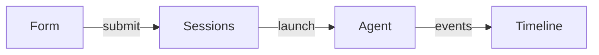

# PR

One PR, its title and body written from the branch's diff and the evidence behind it. The body is what a reviewer reads first, so it always describes the diff as it stands: a refresh rewrites the title and body whole.

You own the title and the body. Draft or ready is the caller's word — `/archie-implement` asks for a draft and marks it ready from its review's grade; anyone else gets a ready PR.

## 1. Resolve

### Where the tree lives

The folder plans in Archie when its `origin` remote clearly matches one Project's repo in the Archie MCP server's `guide` Index. Compare host and path only, so `git@github.com:me/app.git` matches `https://github.com/me/app`. No `origin`, no match or no Archie connection means the tree lives on files, as the steps below describe. Several matches, or an unclear one, means asking the human which Project this is.

In Archie, every reference is a Task key such as `ARC-12`; refuse a `3.2` or a `3.2#1` with one line saying the folder plans in Archie. Act as the Agent whose description in the Index fits **building**, or as the Task's assignee when it is an Agent, chosen once for the session. The steps below name the tree's files and markers, and the `guide` says how each is read and written in Archie. A Status, marker or Type a step names is the Status or Type whose description fits it; when none clearly fits, or several do, stop and ask the human, naming the step and `/archie-setup`. Brief any helper you dispatch or invoke with the mode and the Agent.

Read off the repo and the caller:

- **The PR.** `gh pr view --json number,baseRefName` on the branch. One open means a **refresh**; none means an **open**, against `main` unless the caller names a base.
- **The reference**, when the caller names a Task or Epic. Epics are numbered directories under `.archie/`, so `3.2` is child `02` of child `03` of the root, and its Tasks are `tasks/NN-<slug>.md` inside it. No reference makes this an **ad-hoc** PR.
- **The language.** The terms in `CONTEXT.md` — in Archie, the Project's term Notes. Name things the way the glossary does.

Done when you know open or refresh, the reference or ad-hoc, and the base.

## 2. Gather the evidence

Evidence is a **before and after**, collected before any is produced:

- **Proof** — each Task's `## Proof` section names the test behind every criterion, and the app walk behind the rest.
- **The session** — test runs, gate output and screenshots already in this conversation.

For what is missing, run the repo's test gate for the after. For the before, run the new or changed tests against the base: `git worktree add` at the base, copy those test files in, run them, and remove the worktree. A test that passes on the base proved nothing, so leave it out of Evidence.

**Screenshots** prove a visual change best, and need a home the PR can link:

- **In Archie** — upload each as an Asset on the Task it proves, or on the Epic for a leaf-wide outcome, and link the Asset.
- **On files** — commit each into the leaf's directory under `.archie/`, as `screenshots/<task-number>-<slug>.png`, push, and link `https://github.com/<owner>/<repo>/blob/<sha>/<path>?raw=true`, pinned to that commit.
- **Ad-hoc** — there is no leaf to hold them, so Evidence carries test runs and output alone.

A screenshot that lives only in the conversation, with no file behind it, becomes one line saying what the screen showed.

Done when every change in the diff that can carry evidence has a before and an after, or a line saying why it has none.

## 3. Write the title and body

**The title** follows the repo's PR conventions: the `## Project facts` line in `AGENTS.md`, else the shape of the last merged titles (`gh pr list --state merged --limit 10`).

**The body** is this template:

```md
## Summary

{diagram, diff-sketch, or tree}

## Evidence

- **Before:** {screenshot, output, or failing test run}
  **After:** {screenshot, output, or passing test run}

## Merge Danger

**Door:** {one-way | two-way}

{optional: why}

**Blast Radius:** {one word}

{optional: what could break once merged}
```

Prose stays brief: a line of text beside each visual, and no preamble.

### Summary

The **smallest view** that makes the change clear. Usually one view, at most two, picked by what the change is:

- **Logic or an algorithm** — pseudocode.
- **Runtime control flow** — a call tree.
- **UI structure** — a component tree, with the state and module boundaries that matter.
- **File responsibility or a broad refactor** — a shallow file tree, one comment per entry.
- **Interaction or data flow between parts** — Mermaid.

When the shape already exists and the point is what changed, draw it as a `diff` block in the same view — `+` for added lines, `-` for removed, the rest as context:

```diff
 submitForm
   createSession
     persistPrompt
+    expandSkillMention
     launchAgent
-  navigateToSession
+  navigateToSession
+    subscribeToEvents
```

Show the whole block when most of it is new, when cutting context would hide ownership or order, or when the reader needs a copyable target shape. A Mermaid view stays small:



Keep only the calls, files, props, states and boundaries the point needs.

### Evidence

One Before/After pair per outcome, from step 2. A test run is written as the test in pseudocode plus its result — `saving unchanged content returns the cached result — fails` then `— passes`. A screenshot is its link, with one line saying what it shows.

### Merge Danger

**Door** — **two-way** when reverting the merge undoes it completely, **one-way** when something outlives a revert: a migration, deleted data, a published contract, a message already sent. A one-way door says what outlives the revert.

**Blast Radius** — one word for how far a failure reaches: `none`, `local`, `module`, `app`, `consumers`. Then, when it is wider than `local`, the concrete ways it shows: layout shift, a breaking change for consumers, mobile responsiveness, a slower query. A criterion no test reached and nobody walked in the app is named here as the risk it is.

Done when every section is filled from the diff and the evidence, and nothing in the body describes code the diff no longer has.

## 4. Publish

Push the branch, then write the body to a file and:

- **Open** — `gh pr create --title "…" --body-file <file> --base <base>`, with `--draft` when the caller asked for one.
- **Refresh** — `gh pr edit <number> --title "…" --body-file <file>`.

Done when the PR shows the new title and body, and you have given the caller its link.
